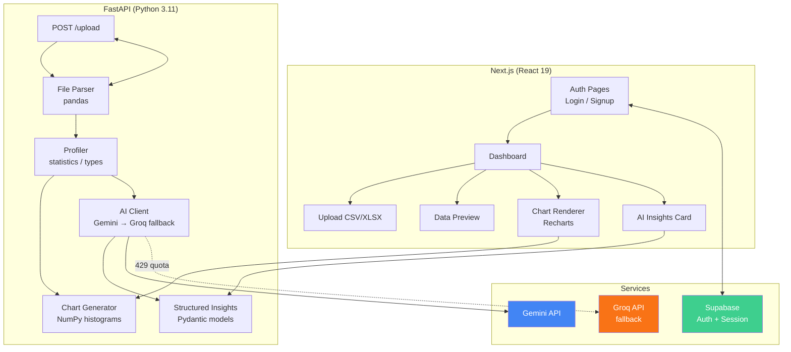

# Intelletrics 🔍

**AI-powered data analytics platform** — upload a CSV or Excel file and get automated insights, statistical summaries, interactive visualizations, and natural-language analysis in seconds. No code, no SQL, no setup.

---

## Features

| Feature | Details |
|---|---|
| **Upload & Preview** | Drag-and-drop CSV / Excel upload, instant 10-row preview |
| **Statistical Profiling** | Auto-detect numeric, categorical, boolean, and datetime columns; compute mean, median, std, quartiles, missing %, uniqueness |
| **Visualizations** | Histograms for numeric columns, bar charts for categorical columns — generated on-the-fly with Recharts |
| **AI Insights** | Structured natural-language analysis via Gemini (or Groq fallback) — executive summary + per-insight breakdown with category tags |
| **Chart Descriptions** | One-line heuristic descriptions under each chart (range, median, top value, missing count) — zero AI cost |
| **Authentication** | Supabase-powered login / signup with session management |
| **Responsive UI** | shadcn/ui + Tailwind v4 sidebar layout, works on desktop and tablet |

---

## Architecture



### Data Flow

1. **User uploads** a `.csv` or `.xlsx` file via the dashboard
2. **FastAPI** reads it with pandas, runs the profiler (column types, missing values, statistics), generates charts (NumPy histograms for numeric, value-count bar charts for categorical)
3. **AI Client** sends the profile to Gemini (`gemini-2.0-flash`) with a `response_schema` for structured JSON output
4. On **429 rate-limit**, the client auto-falls back to Groq (`llama-3.3-70b-versatile`) with JSON-mode
5. **Frontend** renders the preview table, charts (with heuristic descriptions), and the AI insights card (summary paragraph + structured bullet-points with category badges)

---

## Tech Stack

### Frontend
| Layer | Technology |
|---|---|
| Framework | Next.js 16 (React 19) |
| Styling | Tailwind CSS v4 |
| UI Components | shadcn/ui (Radix primitives) |
| Charts | Recharts |
| Auth | Supabase SSR Client |
| Icons | Lucide React |
| Font | Plus Jakarta Sans + Geist Mono |

### Backend
| Layer | Technology |
|---|---|
| Framework | FastAPI (Python 3.11) |
| Data Processing | pandas, NumPy, OpenPyXL |
| AI (Primary) | Google Gemini — `google-genai` SDK v2 with `response_schema` |
| AI (Fallback) | Groq — `groq` SDK with `response_format=json_object` |
| HTTP Client | httpx |

### Infrastructure
| Service | Role |
|---|---|
| Supabase | Authentication + session management |
| Gemini API | Structured insight generation |
| Groq API | Fallback when Gemini quota is exhausted |

---

## Project Structure

```
Intelletrics/
├── backend/                     # FastAPI Python server
│   ├── main.py                  # API routes, CORS, upload handler
│   ├── profiler.py              # Column profiling (stats, types, missing)
│   ├── chart_generator.py       # Histogram / bar chart generation + descriptions
│   ├── ai_insights.py           # Multi-provider AI client (Gemini + Groq fallback)
│   └── .env                     # API keys (gitignored)
├── frontend/                    # Next.js React application
│   ├── app/
│   │   ├── (main)/              # Protected layout with sidebar
│   │   │   ├── dashboard/       # Upload, preview, charts, insights
│   │   │   └── page.tsx         # Landing page
│   │   ├── auth/                # Login / signup pages
│   │   └── layout.tsx           # Root layout (dark mode, fonts)
│   ├── components/
│   │   ├── charts/              # ChartRenderer (bar, histogram)
│   │   ├── ui/                  # shadcn/ui primitives
│   │   ├── login-form.tsx       # Supabase login component
│   │   ├── signup-form.tsx      # Supabase signup component
│   │   ├── app-sidebar.tsx      # Sidebar navigation
│   │   └── ...
│   ├── lib/supabase/            # Supabase client, middleware, server
│   └── proxy.ts                 # Supabase session middleware
├── README.md
└── .gitignore
```

---

## Getting Started

### Prerequisites

- **Python 3.11+** with `uv` or `pip`
- **Node.js 20+** with `npm`
- **Supabase project** (free tier) — for authentication
- **Gemini API key** (free tier) — [Google AI Studio](https://aistudio.google.com/)
- **Groq API key** (optional, for fallback) — [Groq Console](https://console.groq.com/)

### 1. Clone & Install

```bash
git clone https://github.com/AjayThomas-crl/Intelletrics.git
cd Intelletrics
```

#### Backend

```bash
cd backend
uv venv
source .venv/bin/activate
uv pip install -r requirements.txt
```

#### Frontend

```bash
cd frontend
npm install
```

### 2. Environment Variables

#### `backend/.env`

```env
GEMINI_API_KEY=your_gemini_api_key_here
GROQ_API_KEY=your_groq_api_key_here       # optional fallback
SUPABASE_URL=https://your-project.supabase.co
SUPABASE_PUBLISHABLE_KEY=your_publishable_or_anon_key
SUPABASE_STORAGE_BUCKET=datasets
FRONTEND_URL=http://localhost:3000
```

#### `frontend/.env.local`

```env
NEXT_PUBLIC_SUPABASE_URL=https://your-project.supabase.co
NEXT_PUBLIC_SUPABASE_PUBLISHABLE_KEY=your_anon_key_here
NEXT_PUBLIC_API_URL=http://localhost:8000
```

### 3.1 Configure persistent storage

Run `backend/schema.sql` once in the Supabase SQL editor. It creates the `datasets`
table, enables row-level security, and creates the private `datasets` Storage bucket.
FastAPI uses the authenticated user's JWT for database and Storage access. No service-role
key is required or should be added to this project.

### 4. Run

```bash
# Terminal 1 — Backend (http://localhost:8000)
cd backend
source .venv/bin/activate
uvicorn main:app --reload

# Terminal 2 — Frontend (http://localhost:3000)
cd frontend
npm run dev
```

Open `http://localhost:3000`, sign up, and upload a CSV or Excel file.

---

## API Reference

### `POST /upload`

Upload a dataset file.

**Request**: `multipart/form-data` with file field `file` (`.csv`, `.xlsx`, or `.xls`)

**Response**:
```json
{
  "filename": "sales.csv",
  "content_type": "text/csv",
  "rows": 10000,
  "columns": 8,
  "column_names": ["date", "product", "region", "sales", ...],
  "preview": [{ "date": "2024-01-01", "sales": 500, ... }, ...],
  "charts": [
    {
      "chart": "histogram",
      "column": "sales",
      "labels": ["0-100", "100-200", ...],
      "values": [12, 45, ...],
      "description": "Histogram of sales — Range 0–1200, median 420"
    }
  ],
  "profiles": [
    {
      "name": "sales",
      "type": "numeric",
      "missing": { "count": 2, "percentage": 0.02 },
      "uniqueness": { "count": 750, "ratio": 7.5 },
      "statistics": { "mean": 450.0, "median": 420.0, "std": 180.0, "min": 0, "max": 1200, "q1": 300, "q3": 600 },
      "distribution": { "top_value": 500, "top_count": 85 }
    }
  ],
  "summary": "The dataset contains 10,000 sales records...",
  "insights": [
    {
      "title": "High missing rate in region",
      "detail": "The region column has 12% missing values...",
      "category": "data_quality",
      "affected_columns": ["region"]
    }
  ]
}
```

### `POST /insights`

Generate AI insights from previously computed profiles (without re-uploading).

**Request**:
```json
{
  "profiles": [ ... ],
  "filename": "data.csv",
  "rows": 10000,
  "columns": 8
}
```

**Response**:
```json
{
  "insights": "The dataset contains 10,000 rows..."
}
```

---

## AI Provider Fallback

The `_ProviderChain` in `ai_insights.py` tries providers in order:

1. **Gemini** — structured output via `response_schema` (Pydantic model)
2. **Groq** — JSON-mode fallback via `response_format={"type": "json_object"}`

If a provider returns HTTP 429 (quota exhausted), the chain automatically tries the next. If both are exhausted, you get a clear error message.

To register a provider, ensure its API key is in `backend/.env`:

```env
GEMINI_API_KEY=...     # tried first
GROQ_API_KEY=...       # tried second (optional)
```

---

## Roadmap

- [x] File upload (CSV / Excel)
- [x] Data preview
- [x] Statistical profiling
- [x] Chart generation (histograms, bar charts)
- [x] AI insights (Gemini + Groq fallback)
- [x] Chart descriptions
- [ ] **Supabase dataset persistence** — save uploads to rows
- [ ] **Dataset history** — browse and revisit past uploads
- [ ] **Predictive models** — basic ML on uploaded data
- [ ] **PDF / Excel export** — download reports
- [ ] **Custom dashboard builder** — pin charts and metrics
- [ ] **Scheduled analyses** — cron-driven periodic profiling
- [ ] **Database connectors** — MySQL, PostgreSQL, Snowflake
- [ ] **Role-based access control**
- [ ] **Anomaly detection engine**
- [ ] **Interactive AI agent** — multi-step conversational analysis

---

## Contributing

1. Fork the repo
2. Create your feature branch (`git checkout -b feat/awesome`)
3. Commit your changes (`git commit -m 'feat: add awesome thing'`)
4. Push (`git push origin feat/awesome`)
5. Open a Pull Request

---

## License

MIT — see [LICENSE](./LICENSE).
