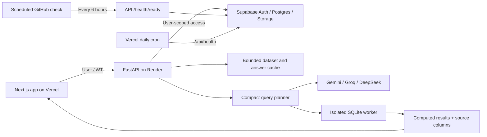

# Intelletrics

A workspace for exploring CSV and Excel files. Upload a dataset, inspect its statistics
and charts, and ask questions in plain language. Built by Ajay Thomas. MIT licensed.

- **App:** https://intelletrics.vercel.app
- **API:** https://intelletrics.onrender.com
- **API docs:** https://intelletrics.onrender.com/docs

## What works

- CSV, XLSX, and XLS uploads; the first Excel worksheet is analyzed.
- Data preview, column profiling, missing-value statistics, histograms, and category charts.
- Short AI-generated upload insights.
- Dataset Q&A: filters, grouped totals, averages, rankings, percentages, date trends,
  window calculations, medians, sample standard deviations/variances, and Pearson correlations.
- Short follow-up questions using up to two previous questions as context.
- Supabase email/password and Google authentication, private file storage, and dataset ownership.
- Signup validation, accessible inline errors, password confirmation, and email-confirmation status.

Questions must be answerable from the uploaded dataset. Ambiguous questions, causal claims,
forecasts, and requests for unavailable information need clarification. Generated queries
can still misunderstand a question; check the result and source columns before relying on it.
Dataset history remains a placeholder; it is not a finished browsing feature.

## Architecture


```mermaid
flowchart LR
  Browser[Next.js app on Vercel] -->|User JWT| API[FastAPI on Render]
  API -->|User-scoped access| Supabase[Supabase Auth / Postgres / Storage]
  API --> Cache[Bounded dataset and answer cache]
  API --> Planner[Compact query planner]
  Planner --> AI[Gemini / Groq / DeepSeek]
  Planner --> Worker[Isolated SQLite worker]
  Worker --> Results[Computed results + source columns]
  Results --> Browser
  GitHub[Scheduled GitHub check] -->|Every 6 hours| Ready[API /health/ready]
  Ready --> Supabase
  Vercel[Vercel daily cron] -->|/api/health| Supabase
```

AI proposes a short SQL query; it does not calculate the answer or execute Python.
The worker loads only the authorized dataset into an in-memory SQLite database. Runtime
SQL authorization permits reads from that table and an allowlist of analytic functions.
Writes, external databases, extensions, system tables, recursive queries, and multiple
statements are rejected. Column IDs (`c0`, `c1`, …) support arbitrary original headers.

The worker has a 5-second SQL deadline and a 20-second process deadline, including startup
and loading. At most two query workers run concurrently per API process. Results are capped
at 100 rows and approximately 256 KiB; aggregates use the full matching data before that cap.

Blocking storage access and query execution run off the FastAPI event loop. Upload and reload
use the same parser and column normalization, so a Render restart does not change column names.
The process-local cache holds up to four datasets, 64 MiB of dataframe data, for 30 minutes,
with up to 16 cached answers per dataset. Supabase remains the persistence layer.

### Keeping token use low

- Row counts, schema listings, missing-value reports, dataset summaries, and simple numeric
  aggregates can run without AI. Repeated requests can use cached answers without an AI call.
- Other questions normally use **one successful AI generation** for a SQL plan, with a
  **768-token output ceiling**. This is a limit, not the usual consumption or a price guarantee.
- The prompt contains column names/types and at most two short text samples per column,
  with a shared 600-character sample budget. Full rows and query results are not sent for narration.
- Recent questions are included only for questions that appear to refer to earlier answers.
  Complete chat transcripts are never sent.
- An invalid generated query gets at most one repair attempt. Provider failures can trigger
  fallback requests. Each provider attempt has a 12-second timeout.
- Gemini uses minimal thinking on the default model. Answers are formatted from computed
  results locally, without a second AI call.
- Upload insights use at most 16 column profiles and a 1,024-token output ceiling. The full
  deterministic profile is still returned to the UI.

Defaults: `gemini-3.5-flash-lite`, `openai/gpt-oss-20b` on Groq, and `deepseek-chat`.
Override these using environment variables as provider availability changes. At least one
provider key is required for questions outside the deterministic shortcuts.

## Project layout

```text
backend/
  main.py                  Routes and upload flow
  ask_on_data.py           Q&A orchestration, response formatting, answer cache
  query_planner.py         Compact AI context and deterministic shortcuts
  query_engine.py          Read-only SQL authorization and analytic functions
  query_runner.py          Process isolation and execution deadlines
  data_io.py               Shared upload/reload parser and limits
  dataset_store.py         Bounded, expiring dataframe cache
  ai_insights.py           Structured AI providers and fallback
  auth.py                  User JWT validation
  persistence.py           User-scoped Supabase data and storage operations
  health.py                Database readiness probe
  profiler.py              Column statistics
  chart_generator.py       Chart data
  tests/                   API, query, isolation, cache, and provider regression tests
frontend/
  app/page.tsx             Landing page
  app/landing.module.css   Isolated landing-page styles
  app/api/health/route.ts  Vercel database health check
  components/landing/     Interactive, precomputed sample dataset
  components/chat/        Dataset Q&A interface
  components/signup-form.tsx
  lib/signup-validation.ts
  vercel.json              Daily production database check
.github/workflows/
  test.yml                 Backend tests, frontend typecheck and lint
  keep-alive.yml           Scheduled Render/Supabase availability check
```

## Local development

Use Python 3.12+ and Node.js 22+. Install backend dependencies:

```bash
cd backend
uv venv --python 3.12
source .venv/bin/activate
uv pip install -r requirements-dev.txt
cp .env.example .env
```

Configure `backend/.env`:

```dotenv
SUPABASE_URL=https://your-project.supabase.co
SUPABASE_PUBLISHABLE_KEY=your_publishable_or_anon_key
SUPABASE_STORAGE_BUCKET=datasets
FRONTEND_URL=http://localhost:3000
GEMINI_API_KEY=your_key
# Optional fallback providers:
GROQ_API_KEY=
DEEPSEEK_API_KEY=
# Optional model overrides:
GEMINI_MODEL=gemini-3.5-flash-lite
GROQ_MODEL=openai/gpt-oss-20b
DEEPSEEK_MODEL=deepseek-chat
```

Use a publishable/anon key, not a service-role key. Data requests use the signed-in user's
JWT and Supabase row-level security. Existing process environment variables override `.env`.
For a new Supabase project, apply `backend/schema.sql` in its SQL editor to create the datasets
table, private bucket, and ownership policies. Existing deployments with that schema need
no migration for these Q&A changes.

Configure `frontend/.env.local` from `.env.example`:

```dotenv
NEXT_PUBLIC_SUPABASE_URL=https://your-project.supabase.co
NEXT_PUBLIC_SUPABASE_PUBLISHABLE_KEY=your_publishable_or_anon_key
NEXT_PUBLIC_API_URL=http://localhost:8000
```

```bash
# Terminal 1, from backend/
uvicorn main:app --reload --port 8000

# Terminal 2, from frontend/
npm ci
npm run dev
```

In Supabase Auth URL settings, add `http://localhost:3000/auth/callback` and the production
callback URL to allowed redirects. Enable Google in Supabase if using Google sign-in.
Client-side signup validation complements Supabase's authentication policies; configure
server-side password requirements in Supabase Auth as well.

## API

`POST /upload` and `POST /ask` require `Authorization: Bearer <user-access-token>`.

### POST /upload

Multipart form field `file`. Defaults: 25 MiB, 250,000 rows, 200 columns. Returns `dataset_id`,
file metadata, preview, profiles, charts, summary, and insights. AI insight failure does not
prevent an otherwise valid upload. The `MAX_UPLOAD_BYTES`, `MAX_ROWS`, and `MAX_COLUMNS`
environment variables can change the limits.

### POST /ask

```json
{
  "dataset_id": "uuid-from-upload",
  "question": "Which region has the highest total sales?",
  "previous_questions": []
}
```

`question` is trimmed and must contain 1–2,000 characters. Optional `previous_questions`
contains at most two strings, each at most 500 characters.

```json
{
  "answer": "region: East; total_sales: 31,000.",
  "operation": "query",
  "result": [{ "region": "East", "total_sales": 31000 }],
  "source_columns": ["Region", "Sales"],
  "truncated": false,
  "cached": false
}
```

`operation` may also be `count_rows`, `schema`, `missing_values`, `dataset_summary`, or
`clarification`. Clarifications return an empty result object. Existing response keys remain;
`truncated` and `cached` are additive. The former fixed five-operation planner is replaced by
SQL planning, so clients should display results rather than hard-code operation names.

Status codes: 401 for authentication, 404 for absent/unowned datasets, 422 for invalid inputs,
408 for analysis timeouts, and 502 for storage/provider/query failures.

### Health checks

- `GET /` or `HEAD /`: Render process liveness, no database request.
- `GET /health/ready`: queries Supabase PostgREST, returns 503 if unavailable and 200 with
  `database: "ok"` and the Render commit revision when healthy. Successful probes are cached
  for 60 seconds. No dataset rows or secrets are returned.
- Vercel `GET /api/health`: independent database probe, so Render sleeping does not stop it.
  It is public by default and returns only status. Set optional `CRON_SECRET` in Vercel to
  require its bearer token; Vercel automatically supplies that token to scheduled invocations.

## Production deployment and inactivity

Vercel uses the `frontend` root; Render uses the `backend` root. Deploy both from `main`.
Render build command: `pip install -r requirements.txt`. Start command:
`uvicorn main:app --host 0.0.0.0 --port $PORT`. Set its Python runtime to 3.12 or later.
Set Render `FRONTEND_URL=https://intelletrics.vercel.app` and Vercel
`NEXT_PUBLIC_API_URL=https://intelletrics.onrender.com`. Set the same Supabase project in both.
Never put AI API keys or a service-role key in `NEXT_PUBLIC_*` variables.

Database availability is checked externally, not by a timer inside a sleeping Render process:

1. GitHub Actions calls `/health/ready` at minute 17 every six hours (UTC), with retries and
   a manual **Run workflow** option. It wakes Render and queries the database. The repository
   variable `BACKEND_URL` can override the default production URL.
2. Vercel Cron calls `/api/health` daily around 04:23 UTC. This reads Postgres directly with
   the publishable key and RLS, using the existing Vercel environment. It requires no extra
   service or database migration and supports Vercel's daily Hobby-plan scheduling limit.

Supabase can pause free projects with low database activity; these probes provide regular
queries and expose outages. They cannot resume a project that is already paused. Resume that
project in the Supabase dashboard. Free-tier availability is not guaranteed; paid Supabase
projects avoid inactivity pausing. See [Supabase's pausing policy](https://supabase.com/docs/guides/platform/free-project-pausing).

Render's free service can still sleep between checks; the first real request may need a cold
start. These checks are not an always-on Render guarantee. GitHub schedules may be delayed and
are disabled after 60 days without repository activity on public repositories; the independent
Vercel daily check continues while the production deployment and cron remain enabled.
See [GitHub schedules](https://docs.github.com/en/actions/reference/workflows-and-actions/events-that-trigger-workflows#schedule),
[Vercel cron limits](https://vercel.com/docs/cron-jobs/usage-and-pricing), and
[Render free-service limits](https://render.com/docs/free).

## Verification

```bash
cd backend
python -m pytest -q

cd ../frontend
npm test
npm run lint
npx tsc --noEmit
npm run build
```

Backend regression tests use synthetic datasets and mocked providers; no paid API calls or
Supabase credentials are required. The landing sample is precomputed and makes no AI calls.
